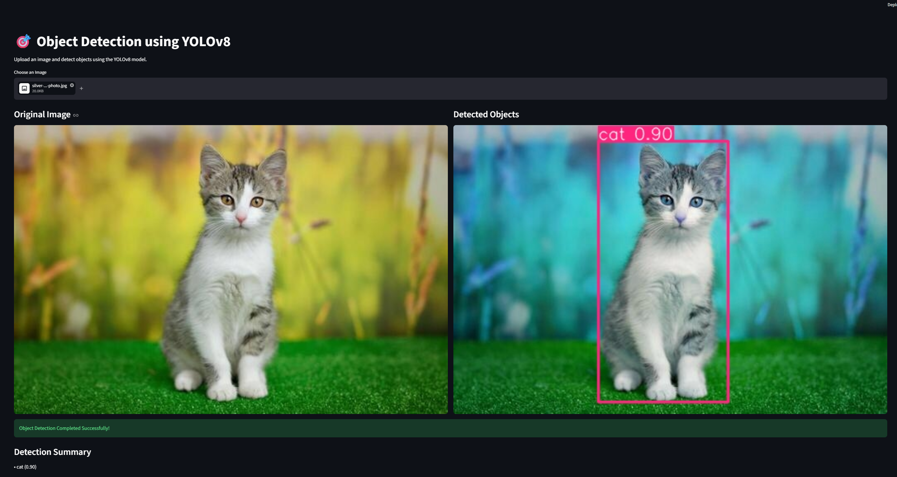

# OptimusAutomate_ObjectDetection
#  Object Detection using YOLOv8

## Project Overview

This project implements a real-time Object Detection application using the YOLOv8 (You Only Look Once) model and Streamlit. Users can upload an image, and the application automatically detects objects, draws bounding boxes, displays object labels, and shows confidence scores.

The project demonstrates the use of Computer Vision and Deep Learning techniques for object recognition using a pre-trained YOLOv8 model.

---

## Features

- Upload images through a web interface
- Detect objects using YOLOv8
- Draw bounding boxes around detected objects
- Display object labels
- Show confidence scores
- Detection summary for all identified objects
- Interactive Streamlit-based UI

---

## Technologies Used

- Python
- YOLOv8 (Ultralytics)
- Streamlit
- OpenCV
- Pillow

---

## Demo

### Application Interface



---

## How It Works

1. User uploads an image.
2. YOLOv8 processes the image.
3. Objects are detected using a pre-trained model.
4. Bounding boxes and labels are generated.
5. Confidence scores are displayed.
6. A detection summary is shown below the results.

---

## Project Structure

```text
OptimusAutomate_ObjectDetection/
│
├── app.py
├── requirements.txt
├── README.md
└── object_detection_demo.png
```

---

## Sample Output

Example Detection:

```text
cat (0.90)
```

---

## Results

The application successfully detects objects in uploaded images and provides:

- Accurate object localization
- Object classification
- Confidence scoring
- User-friendly visualization

---

## Future Improvements

- Webcam-based object detection
- Video object detection
- Multiple image uploads
- Custom-trained YOLO models
- Real-time detection dashboard

---

## Author

Developed as part of the Optimus Automate AI Internship Program.
